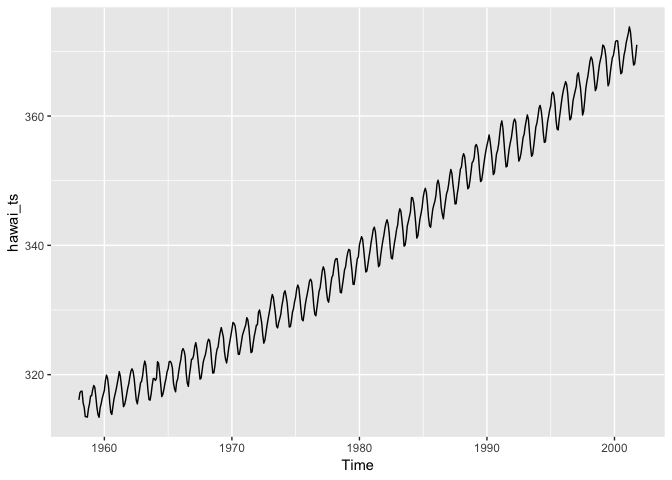
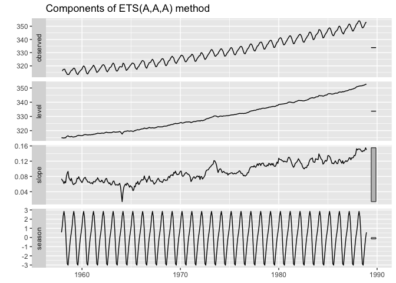
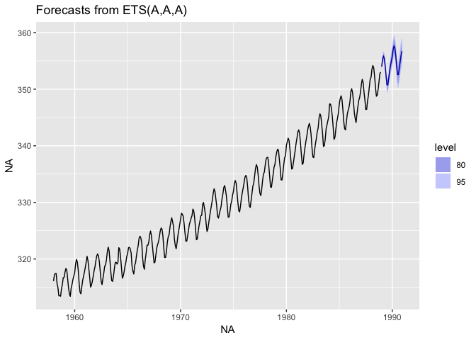
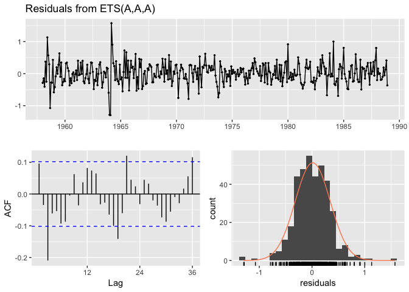

Devoir 5 : Séries temporelles et reproductibilité
================
Véronique Rouleau
05-04-2019

1. Créer une série temporelle du CO2 atmosphérique
--------------------------------------------------

Les données du fichier *hawai.csv* comprennent les moyennes des mesures mensuelles de CO2 atmosphérique en ppm-volume collectées au [Mauna Loa Observatory à Hawaii](https://www.esrl.noaa.gov/gmd/obop/mlo/) de mars 1958 à juillet 2001, inclusivement.

Afin de créer une série temporelle du CO2 à partir des données de *hawai.csv*, j'ai tout d'abord importé le fichier dans R Studio. La fonction `read_csv` a été utilisée car dans le fichier *hawai.csv*, le séparateur de colonne est une virgule et le séparateur décimal est un point.

``` r
library(tidyverse)
```

    ## ── Attaching packages ──────────────────────────────────────────────── tidyverse 1.2.1 ──

    ## ✔ ggplot2 3.1.0     ✔ purrr   0.3.0
    ## ✔ tibble  2.0.1     ✔ dplyr   0.7.8
    ## ✔ tidyr   0.8.2     ✔ stringr 1.3.1
    ## ✔ readr   1.3.1     ✔ forcats 0.3.0

    ## Warning: package 'ggplot2' was built under R version 3.4.4

    ## Warning: package 'tibble' was built under R version 3.4.4

    ## Warning: package 'tidyr' was built under R version 3.4.4

    ## Warning: package 'readr' was built under R version 3.4.4

    ## Warning: package 'purrr' was built under R version 3.4.4

    ## Warning: package 'dplyr' was built under R version 3.4.4

    ## Warning: package 'stringr' was built under R version 3.4.4

    ## ── Conflicts ─────────────────────────────────────────────────── tidyverse_conflicts() ──
    ## ✖ dplyr::filter() masks stats::filter()
    ## ✖ dplyr::lag()    masks stats::lag()

``` r
hawai <- read_csv(file = "hawai.csv")
```

    ## Parsed with column specification:
    ## cols(
    ##   time = col_double(),
    ##   CO2 = col_double()
    ## )

``` r
library("forecast")
```

    ## Warning: package 'forecast' was built under R version 3.4.4

``` r
library("fpp2")
```

    ## Warning: package 'fpp2' was built under R version 3.4.4

    ## Loading required package: fma

    ## Loading required package: expsmooth

J'ai ensuite changé la date en format décimale (par exemple : 1958.167) à une date en format année/mois/jour heure/minute/seconde UTC (par exemple : 1958-03-02 20:00:01)

``` r
library("lubridate")
```

    ## Warning: package 'lubridate' was built under R version 3.4.4

    ## 
    ## Attaching package: 'lubridate'

    ## The following object is masked from 'package:base':
    ## 
    ##     date

``` r
date <- date_decimal(hawai$time)
```

J'ai ensuite ajouté une colonne comprenant la date transformée et j'ai enlevé la colonne *"time"*.

``` r
hawai_date <- hawai %>% mutate(Date = date) %>% select(-time)
```

J'ai ensuite créé une série temporelle de type `ts`.

``` r
hawai_ts <- ts(hawai_date %>% select(-Date), 
               start = c(hawai_date$Date[1] %>% year(), 1),
               frequency = 12)
```

Visualisation de la série temporelle avec `autoplot()` :



2. Séparer la série en parties d'entraînement (environ 70% des données) et en partie test avec la méthode SES
-------------------------------------------------------------------------------------------------------------

La partie d'entraînement (`hawai_ts_train`) comprend environ 70% des données, ce qui représente environ les 373 premières entrées (de 1958-03-02 à 1988-12-01). La partie test (`hawai_ts_test`) comprend donc les 154 dernières entrées (de 1989-01-01 à 2001-12-01).

``` r
hawai_ts_train <- window(hawai_ts, start = 1958, end = 1988.999)

hawai_ts_test <- window(hawai_ts, start = 1989)
```

3. Créer un modèle **ETS** sur les données d'entraînement, puis projeter la prévision de CO2 atmosphérique pour comparer aux données test
-----------------------------------------------------------------------------------------------------------------------------------------

J'ai tout d'abord généré un modèle ETS (*error, tend and seasonnal*).

``` r
hawai_model <- ets(hawai_ts_train)
```

Visualisation de l'évolution des différentes composantes :



J'ai ensuite généré une prédiction :

``` r
hawai_ets <- hawai_ts_train %>% ets()
hawai_fc <- hawai_ets %>% forecast()
```



Analyse d'exactitude effectuée sur la prévision :

``` r
accuracy(hawai_fc, hawai_ts)
```

    ##                       ME      RMSE       MAE          MPE       MAPE
    ## Training set  0.01343818 0.3320063 0.2509684  0.003886716 0.07620193
    ## Test set     -0.75376910 0.8643807 0.7659953 -0.213340205 0.21678072
    ##                   MASE       ACF1 Theil's U
    ## Training set 0.2039634 0.09598341        NA
    ## Test set     0.6225285 0.70951809 0.7024312

4. Effectuer une analyse des résidus
------------------------------------

Analyse des résidus effectuée sur le modèle :

``` r
checkresiduals(hawai_ets)
```



    ## 
    ##  Ljung-Box test
    ## 
    ## data:  Residuals from ETS(A,A,A)
    ## Q* = 60.75, df = 8, p-value = 3.32e-10
    ## 
    ## Model df: 16.   Total lags used: 24

### Commentez : Le modèle est-il fiable? Comment pourrait-il être amélioré?

Le modèle retenu est un ETS(A,A,A) ; nous avons une erreur type A (additive), une tendance de type A (additive) et une saisons de type A (additive).

L'analyse des seuils (95%) de significtion de l'autocorrélation indique sur la possibilité de conduire la série temporelle vers un processus de modélisation. Ici, il est possible d'observer sur le graphique d'autocorrélation qu'il existe des corrélations significatives, mais que les données situées près les unes des autres pourraient être plus difficiles à modéliser.

Les résidus contiennet de l'autocorrélation (ce qui devrait être évité) : il existe une structure dans les données qui n'a pas été capturée par le modèle.

Le test de Ljung-Box indique que la probabilité que ces données soient générées selon un bruit blanc est inférieure à 0.0001% (p&lt; 2.2e-16). En d'autres mots, la probabilité que la série soit un bruit blanc est presque nulle.La série temporelle est conséquemment différente du hasard, d'une série où il n'y a pas de structure.

Enfin, les résidus semblent distribués normalement.Le graphique de la distribution des résidus montre toutefois des valeurs aberrantes.
